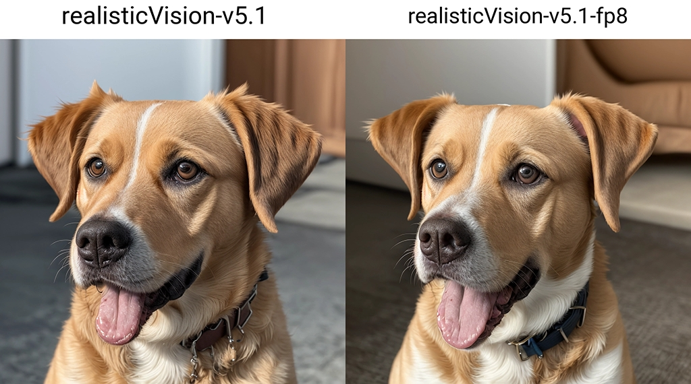
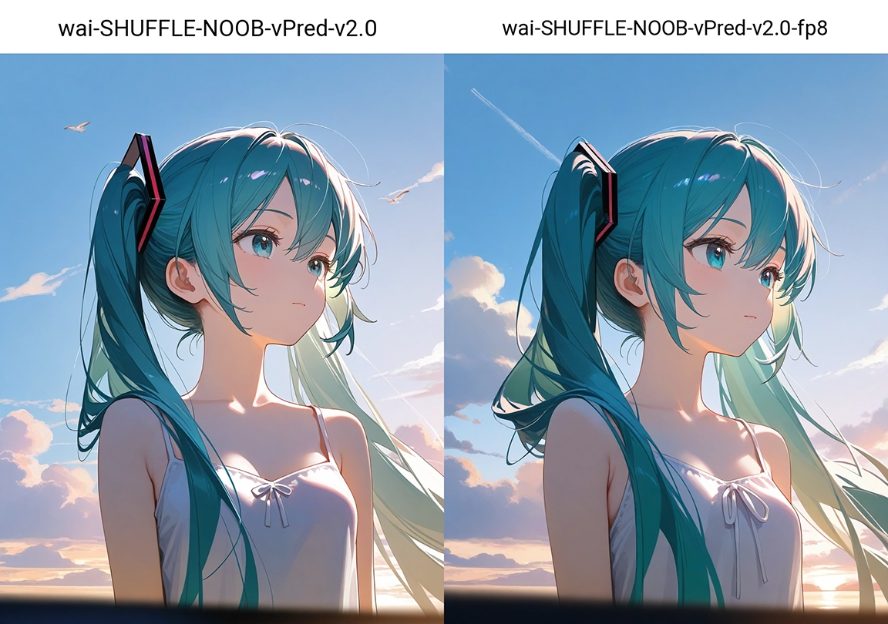

# SD Webui Compressor
This is an Extension for the [Automatic1111 Webui](https://github.com/AUTOMATIC1111/stable-diffusion-webui), which adds a new Tab that lets you save an UNet in **fp8** precision to save some storage space.

> Compatible with [Forge](https://github.com/lllyasviel/stable-diffusion-webui-forge)

> Only tested with **SD1** and **SDXL** checkpoints

### Examples

- **realisticVision-v5.1**
    - **fp16:** 1.98 GB
    - **fp8:** 1.18 GB

- **wai-SHUFFLE-NOOB-vPred-v2.0**
    - **fp16:** 6.46 GB
    - **fp8:** 4.07 GB

> [!Note]
> As shown, the results will be different; but the quality is more or less the same
